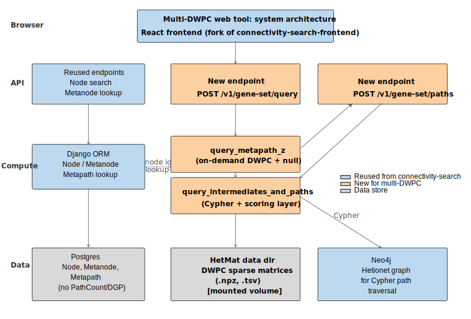
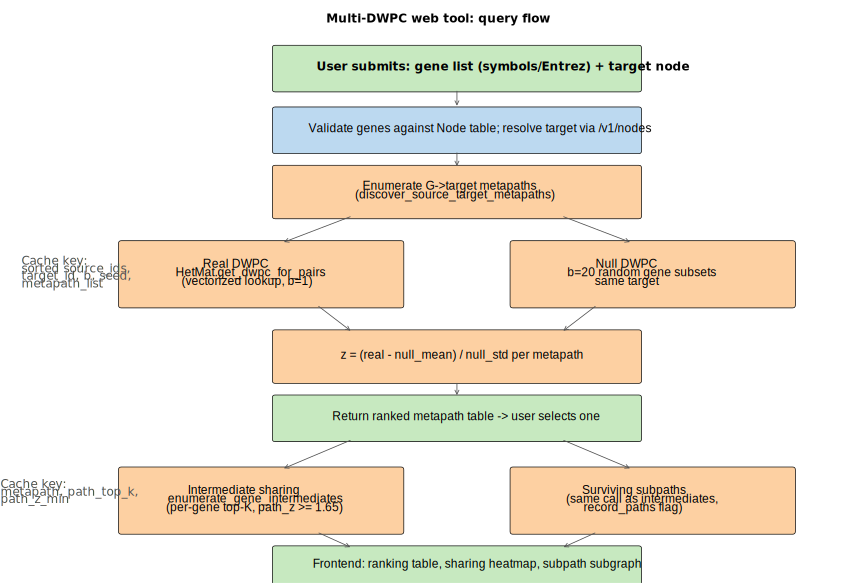

# Items to address

- [ ] Consider using only one link for the repo instead of splitting between two. If one is a fork of the other, reference the non-fork (upstream), and ensure the upstream is up to date with your latest code. This follows a common convention where forks typically include "dev" branches which are then merged with the upstream repo. Sometimes this convention is different where a fork is a custom copy of the upstream which has diverged. I think you mean to keep these things in sync though, so the latter strategy might be preferable.
- [ ] The resource implementation feels very specific given we don't know how the translation into the architecture would work yet (it's listed as "Resource requirement" as opposed to "Resource benchmarks"). I'd consider dropping this or perhaps using softer language (it'd be a common practice to leave this level of detail to the engineers). The soft goal here is that when you're working with a software engineering team it's better to set the stage but avoid managing system-level decisions (because complexity emerges as software is implemented).
- [ ] We're missing a timeline / milestones - this might help set the context for when things happen and how much time there is to tinker until deliverable(s). I suggest creating milestones of some kind to make the progress iterative and focused on certain chunks of the work at a reasonable pace.
- [ ] The diagrams might benefit from a "new" vs" existing" color or symbol encoding to help make it very distinct which parts are incoming. You might also indicate which parts are "existing modified" to help show where work is happening.
- [ ] I'd simplify the title a bit - "audit" makes it seem like we're doing some reporting that might not eventually be a part of this. Instead, you could use the notion of a "feature" or "new capability".
- [ ] Would someone leave with any data exports? If so, what kind and where would they appear in the interface?
- [ ] Consider adding a brief sketch of where this interface might fit into the existing system as a loose suggestion (menu placement, and separately, how the UI might end up looking). This can be a sketch or just copy paste portions of your existing UI and make indications as to how this might operate.
- [ ] Where should the team communicate with you? Meetings only, chat, email, etc?
- [ ] How often would you like to meet synchronously with us? Weekly, monthly, ad-hoc, etc?
Will our involvement be one-time or ongoing? Who will maintain the service long term?

# Multi-DWPC Web Tool — Audit and Requirements

current repo: https://github.com/lagillenwater/multi-dwpc

incrementally moving with in-lab PR reviews: https://github.com/greenelab/multi-dwpc

## 1. Purpose

Build a public web tool that answers the question:

> "How does my list of source nodes (e.g., genes) connect to a target node, beyond what their individual connectivity would predict — and which intermediate nodes carry that signal?"

The look-and-feel and infrastructure should mirror the greenelab connectivity-search stack ([search.het.io](https://search.het.io)) so users in the field experience continuity. The science layer (effect-size z-scores, intermediate sharing, surviving subpaths) is unique to multi-DWPC.

A working Streamlit MVP exists at `app.py` and is the reference implementation for the science. This document specifies the production rebuild.

## 2. greenelab connectivity-search

The cloned reference is at `connectivity-search-backend/`. Companion frontend (not cloned here) lives at https://github.com/greenelab/connectivity-search-frontend.

### 2.1 What connectivity-search does today

The connectivity-search stack answers a **pair-based** question: given a single source node and a single target node in Hetionet v1.0, return all metapaths connecting them, with precomputed path counts, DWPC values, and degree-grouped permutation null statistics. Results are precomputed and stored in Postgres; only the actual paths (Cypher traversal) are computed on demand from Neo4j.

Endpoints (`connectivity-search-backend/dj_hetmech/urls.py`):

| Endpoint | Purpose |
|---|---|
| `GET /v1/node/<pk>` | One node |
| `GET /v1/nodes/?search=...` | Trigram + prefix search of nodes (autocomplete) |
| `GET /v1/random-node-pair/` | Sample a random source/target |
| `GET /v1/metapaths/source/<int>/target/<int>/` | All metapaths between a pair, sorted by p-value |
| `GET /v1/paths/source/<int>/target/<int>/metapath/<str>/` | Paths from Neo4j for one (source, target, metapath) |

Schema (`dj_hetmech_app/models.py`):

| Model | Role |
|---|---|
| `Metanode` | One row per node type (Gene, Compound, ...) |
| `Node` | One row per Hetionet node |
| `Metapath` | One row per metapath, with aggregate stats |
| `DegreeGroupedPermutation` | Null DWPC mean/sd binned by (source_degree, target_degree) |
| `PathCount` | Precomputed PC + DWPC + p-value for one (metapath, source, target) triple |

### 2.2 What is reusable as-is

| Asset | Reuse for multi-DWPC |
|---|---|
| `Metanode`, `Node`, `Metapath` tables and admin/migrations | Reuse verbatim — node identity and metapath metadata are identical |
| `NodeViewSet` + trigram search | Reuse verbatim for autocomplete on the gene list and target inputs |
| `RandomNodePairView` (adapt to "random target") | Reuse for the demo button |
| `QueryPathsView` (Neo4j Cypher traversal) | Reuse for hop retrieval per (source gene, target, metapath). Multi-DWPC layers per-path z scoring + intermediate-sharing aggregation on top of the Cypher-returned paths (see 2.3). |
| Frontend node-search component, metapath rendering, node icons | Reuse verbatim |
| Docker compose + Postgres + Neo4j + gunicorn deployment recipe | Reuse verbatim |

### 2.3 What must be added

| Asset | Why add |
|---|---|
| `PathCount` table and all writes | Multi-DWPC permutes source-set membership at query time, not Hetionet structure.  |
| `DegreeGroupedPermutation` null | Connectivity-search uses degree-binned XSWAP nulls. Multi-DWPC uses **random gene-subset draw** (see `src/multi_dwpc_query.py` line 84). |
| `QueryMetapathsView` (pair-based) | Multi-DWPC takes a **set** of source nodes, not a single source. |
| Per-path z scoring + intermediate-sharing layer | New adapter that consumes hop sequences from the reused `QueryPathsView` (Cypher), computes `path_z` per path against the random-gene-subset null, and aggregates intermediate-node sharing across the source-gene set. Local `src.path_enumeration.enumerate_paths` enumeration stays for the Streamlit MVP and offline scientific work; production reads paths from Neo4j. |
| `p_value` / `adjusted_p_value` reporting | Multi-DWPC reports **effect-size z** (see `web_tool_discussion.md` §1.1c). Replace p-value columns with `effect_size_z`. |

### 2.5 Architecture diagram

Source: `docs/figures/web_tool/build_diagrams.py`. SVG is editable in Illustrator (text stays as `<text>` elements via `svg.fonttype=none`).

## 3. Functional requirements

### 3.1 Inputs

- **Source nodes**: list of features (satart with gene symbols or Entrez IDs), one per line or comma-separated. Symbols must resolve to a Hetionet Gene node; unresolved tokens are returned in a warnings array.
- **Target node**: single node, any metanode supported by the metapath enumerator (MVP: Biological Process only, matching `app.py`).
- **Optional advanced parameters** (collapsed by default):
  - `b` (null replicates), default 20, range 5–100
  - `path_top_k`, default 100, range 10–1000
  - `path_z_min`, default 1.65, range 0–5
  - `seed`, default 42

### 3.2 Outputs

Three views, each returned by a separate endpoint:

1. **Metapath ranking** — table of metapaths sorted by `effect_size_z`. Columns: metapath abbreviation, metapath name, real mean DWPC, null mean DWPC, null sd DWPC, diff, z. Default sort: z descending.
2. **Intermediate sharing** (per metapath) — table of intermediate nodes ranked by number of source genes that share them, plus the gene list for each intermediate. Visualized as a binary heatmap (intermediate × gene).
3. **Surviving subpaths** (per metapath) — paths surviving `path_z >= path_z_min`, returned as a list of hop sequences with per-path score and z. Visualized as a layered subgraph (hops as columns, nodes stacked within column).

### 3.3 Query flow

### 3.4 Reference behaviour

The Streamlit MVP at `app.py` is the canonical behavioural reference. 

## 4. Resource requirements

Measured against the Streamlit MVP (`app.py`) on first launch — the preload step in `get_hetmat()` materializes all G→BP DWPC matrices via `discover_source_target_metapaths`. Numbers are from a warm disk cache on Macbook Pro, M4, 24 GB ram.

| Phase | Resident memory | Wall time |
|---|---|---|
| `HetMat` import + init | ~0.1 GB | < 1 s |
| Preload all 52 G→BP DWPC matrices (warm disk cache) | peak ~2.0 GB; settles to ~1.4 GB after preload | ~90 s |
| Per-query incremental | ≪ 0.1 GB | seconds |

**Disk cache**: `data/dwpc_cache/` is ~24 GB once fully populated for `damping=0.5`. First deployment must run the preload to materialize this; cold-cache wall time is dominated by sparse-matrix multiplication and is much longer than warm preload (budget hours, not minutes). Subsequent restarts read from disk cache. -- currently DWPC connectivity search uses previously calculated significant DWPC values for lookup. We may be able to speed this up with on-the-fly computation with another tool a biostatistician is working on, but for now this is how it works. 

## 5. Caching strategy

- **DWPC matrices**: in-process LRU, size capped by RAM. `src.dwpc_direct.HetMat` already implements this.
- **Query results**: sorted source_ids, target_id, b, seed, metapath_list
- **Path enumeration results**: metapath, path_top_k, path_z_min

