# Multi-DWPC Web Tool 

repo: https://github.com/greenelab/multi-dwpc

## 1. Purpose

Build a public web tool that answers the question:

> "How does my list of source nodes (e.g., genes) connect to a target node, beyond what their individual connectivity would predict — and which intermediate nodes carry that signal?"

The look-and-feel and infrastructure should mirror the greenelab connectivity-search stack ([search.het.io](https://search.het.io)) so users in the field experience continuity. The science layer (effect-size z-scores, intermediate sharing, surviving subpaths) is unique to multi-DWPC.

A working Streamlit MVP exists at `app.py` and is the reference implementation for the science. This document specifies the production rebuild.

## 2. greenelab connectivity-search

The cloned reference is at `connectivity-search-backend/`. Companion frontend (not cloned here) lives at https://github.com/greenelab/connectivity-search-frontend.

### 2.1 What connectivity-search does today

The connectivity-search stack answers a **pair-based** question: given a single source node and a single target node in Hetionet v1.0, return all metapaths connecting them, with precomputed path counts, DWPC values, and degree-grouped permutation null statistics. Results are precomputed and stored in Postgres; only the actual paths (Cypher traversal) are computed on demand from Neo4j.

Endpoints (`connectivity-search-backend/dj_hetmech/urls.py`):

| Endpoint | Purpose |
|---|---|
| `GET /v1/node/<pk>` | One node |
| `GET /v1/nodes/?search=...` | Trigram + prefix search of nodes (autocomplete) |
| `GET /v1/random-node-pair/` | Sample a random source/target |
| `GET /v1/metapaths/source/<int>/target/<int>/` | All metapaths between a pair, sorted by p-value |
| `GET /v1/paths/source/<int>/target/<int>/metapath/<str>/` | Paths from Neo4j for one (source, target, metapath) |

Schema (`dj_hetmech_app/models.py`):

| Model | Role |
|---|---|
| `Metanode` | One row per node type (Gene, Compound, ...) |
| `Node` | One row per Hetionet node |
| `Metapath` | One row per metapath, with aggregate stats |
| `DegreeGroupedPermutation` | Null DWPC mean/sd binned by (source_degree, target_degree) |
| `PathCount` | Precomputed PC + DWPC + p-value for one (metapath, source, target) triple |

### 2.2 What is reusable as-is

| Asset | Reuse for multi-DWPC |
|---|---|
| `Metanode`, `Node`, `Metapath` tables and admin/migrations | Reuse verbatim — node identity and metapath metadata are identical |
| `NodeViewSet` + trigram search | Reuse verbatim for autocomplete on the gene list and target inputs |
| `RandomNodePairView` (adapt to "random target") | Reuse for the demo button |
| `QueryPathsView` (Neo4j Cypher traversal) | Reuse for hop retrieval per (source gene, target, metapath). Multi-DWPC layers per-path z scoring + intermediate-sharing aggregation on top of the Cypher-returned paths (see 2.3). |
| Frontend node-search component, metapath rendering, node icons | Reuse verbatim |
| Docker compose + Postgres + Neo4j + gunicorn deployment recipe | Reuse verbatim |

### 2.3 What must be added

| Asset | Why add |
|---|---|
| `PathCount` table and all writes | Multi-DWPC permutes source-set membership at query time, not Hetionet structure.  |
| `DegreeGroupedPermutation` null | Connectivity-search uses degree-binned XSWAP nulls. Multi-DWPC uses **random gene-subset draw** (see `src/multi_dwpc_query.py` line 84). |
| `QueryMetapathsView` (pair-based) | Multi-DWPC takes a **set** of source nodes, not a single source. |
| Per-path z scoring + intermediate-sharing layer | New adapter that consumes hop sequences from the reused `QueryPathsView` (Cypher), computes `path_z` per path against the random-gene-subset null, and aggregates intermediate-node sharing across the source-gene set. Local `src.path_enumeration.enumerate_paths` enumeration stays for the Streamlit MVP and offline scientific work; production reads paths from Neo4j. |
| `p_value` / `adjusted_p_value` reporting | Multi-DWPC reports **effect-size z** (see `web_tool_discussion.md` §1.1c). Replace p-value columns with `effect_size_z`. |

### 2.5 Architecture diagram

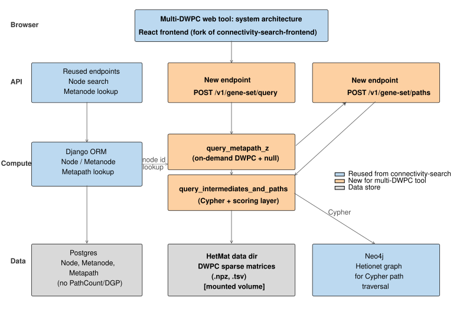

## 4. UI

The UI should follow the creative workflow of the connectivity search tool at het.io. I think that the tool should either have its own landing page from the het.io Explore tab:

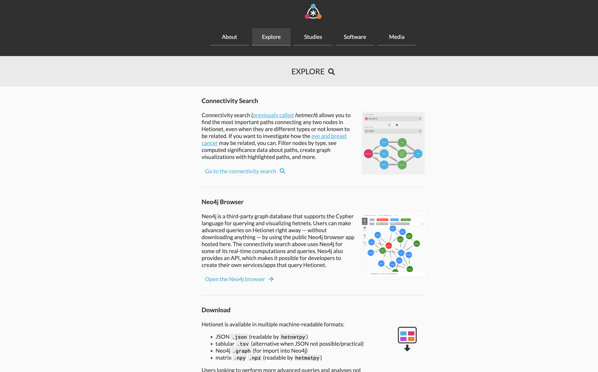

## 3. Functional requirements

### 3.1 Inputs

- **Source nodes**: list of features (satart with gene symbols or Entrez IDs), one per line or comma-separated. Symbols must resolve to a Hetionet Gene node; unresolved tokens are returned in a warnings array.
- **Target node**: single node, any metanode supported by the metapath enumerator (MVP: Biological Process only, matching `app.py`).
- **Optional advanced parameters** (collapsed by default):
  - `b` (null replicates), default 20, range 5–100
  - `path_top_k`, default 100, range 10–1000
  - `path_z_min`, default 1.65, range 0–5
  - `seed`, default 42

### 3.2 Outputs

Three views, each returned by a separate endpoint:

1. **Metapath ranking** — table of metapaths sorted by `effect_size_z`. Columns: metapath abbreviation, metapath name, real mean DWPC, null mean DWPC, null sd DWPC, diff, z. Default sort: z descending.
2. **Intermediate sharing** (per metapath) — table of intermediate nodes ranked by number of source genes that share them, plus the gene list for each intermediate. Visualized as a binary heatmap (intermediate × gene).
3. **Surviving subpaths** (per metapath) — paths surviving `path_z >= path_z_min`, returned as a list of hop sequences with per-path score and z. Visualized as a layered subgraph (hops as columns, nodes stacked within column).

### 3.3 Query flow

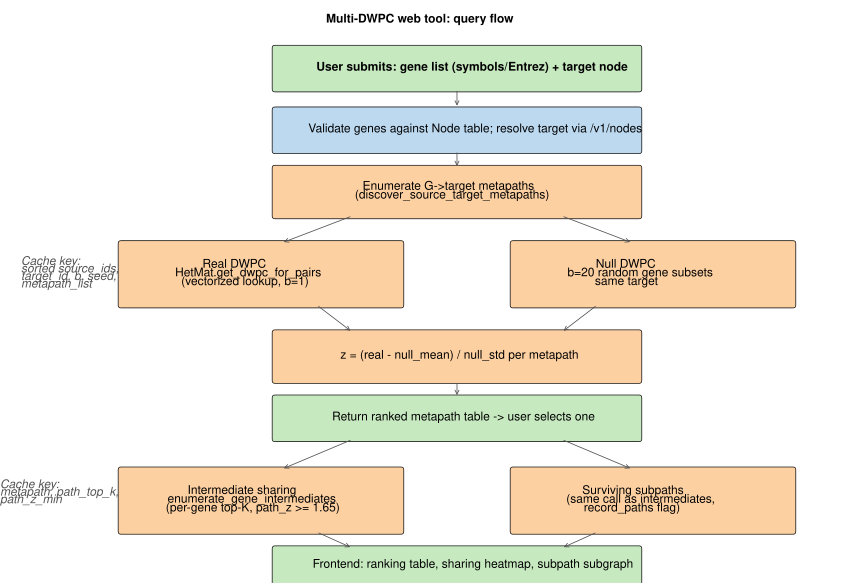

# 4. UI

## UI design ideas

The UI should follow the creative workflow of the connectivity search tool at het.io. I think that the tool should either have its own landing page from the het.io Explore tab:

OR it could be a separate tab for the connectivity search tool:

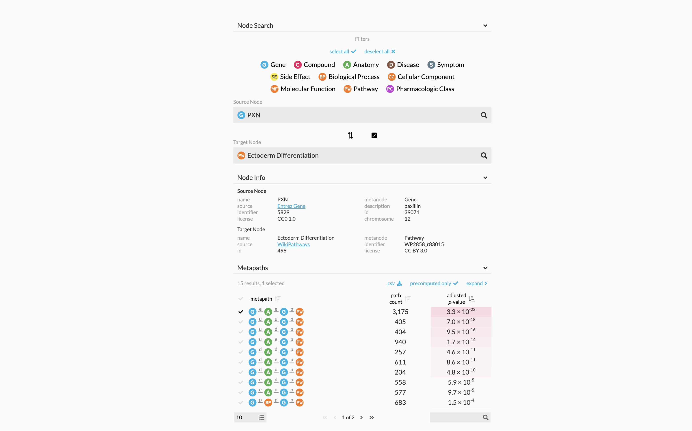

The multi-DWPC tools should follow a similar flow to the connecitivity search tool between a single source and target. For example, the user should input a a list of genes and a single target and get a list of metapath rankings. 

  
  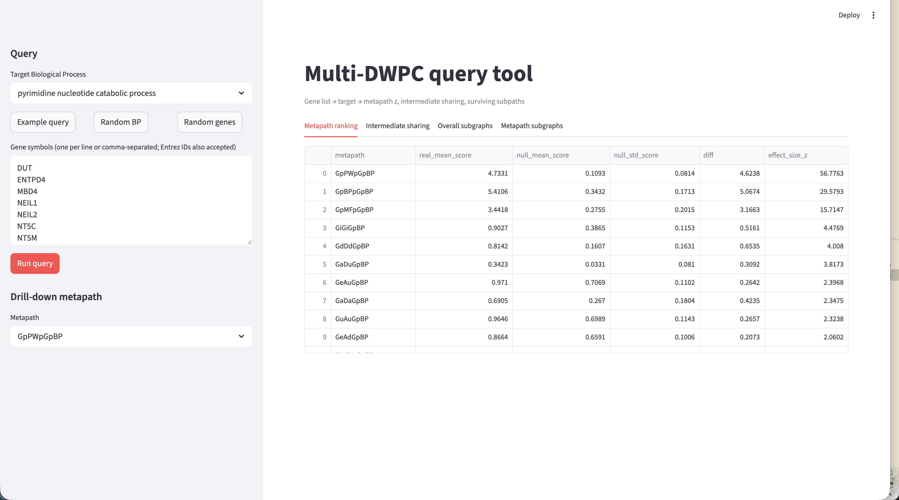

Then I would like to include intermediate node scoring. See the outputs section below. 
Below the scores should show the graph outputs. 

  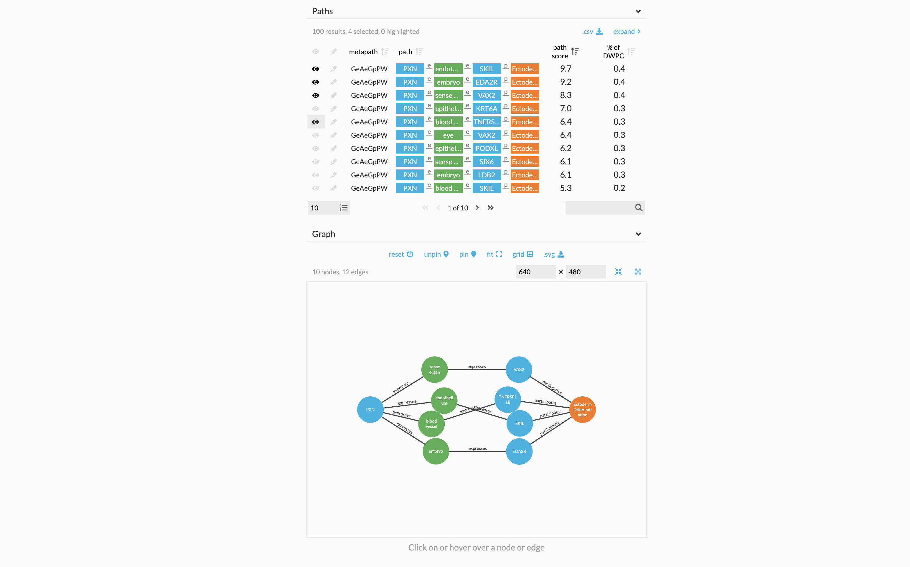
  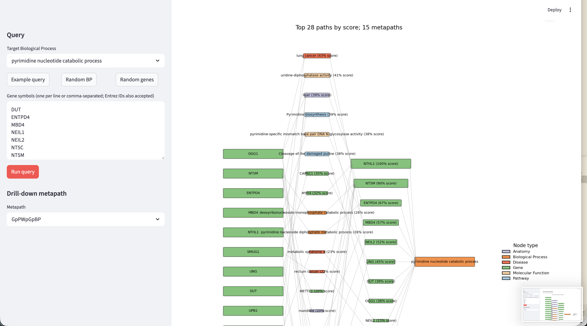

These are all suggestions. Very open to other recommendations. 

## Outputs

The user should be able to output a ranked list of metapaths, with scores and signficance values as seen below.

Also, the table of shared intermediates along with the heatmaps as shown below. 

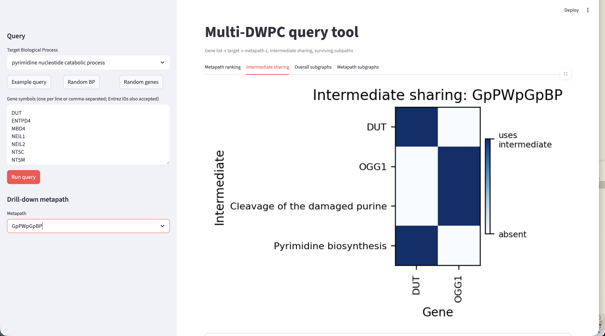
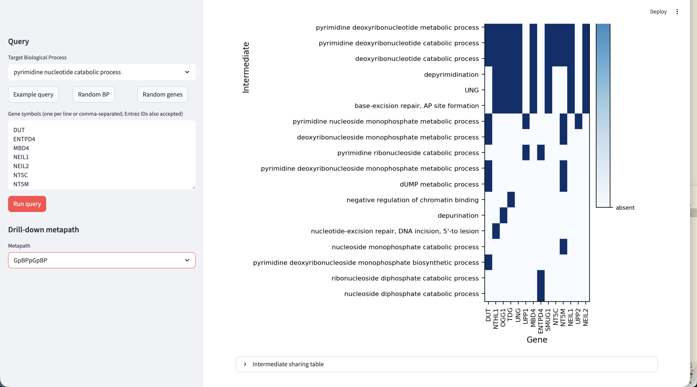

And subgraphs for the subgraphs of top paths, the subgraph of top paths with shared intermediates, and each subgraph by specific metapath. This may be something that a user could build, as in the single path connectivity search. See the some examples below. 

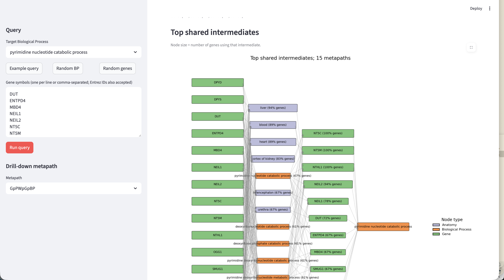
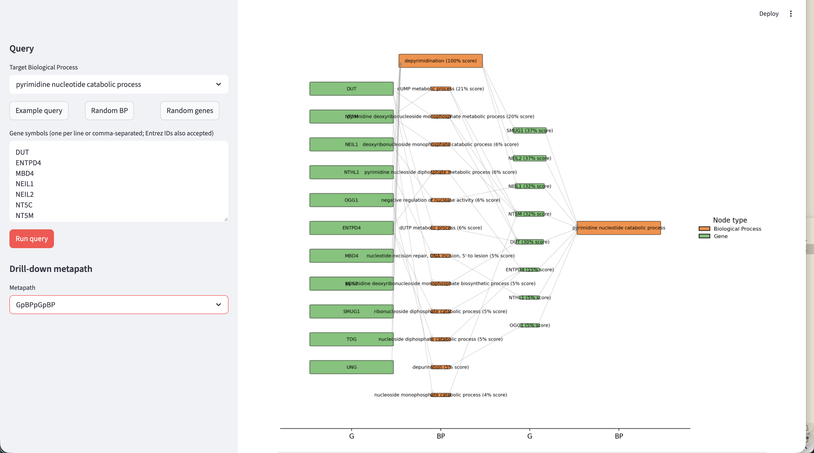

# 5. Timeline

Target: 2-3 months to active public tool. 

## 5.1 Milestones

| Milestone | Target | What demonstrates it |
|---|---|---|
| Kickoff | Week 1 | Team has read the spec, asked questions, set up the dev environment. |
| multi-DWPC scoring | Week 3 | Implement multi-DWPC style path counting, permutation nulls, effect size, and p value reporting|
| intermediate path counts | Week 4 | Implement intermediate path counting approach. Add path count heatmaps|
| interactive subgraph extraction | 1.5 months | interactive subgraphs using Neo4J lookup available in the UI|
| Full feature set | End of month 2 | All three views from §3.2 (metapath ranking, intermediate sharing, surviving subpaths) are visible in the UI. |
| **Public launch** | End of month 3 | Tool is reachable at a public URL. |

## 5.2 Communication platform

- Periodic in-person or zoom meetings to coordinate and answer questions
- Slack for asynchronous messaging: multi-dwpc channel in the GreeneLab Slack

## 5.2 Meeting Cadence

- Weekly 30 min meetings in person or over zoom to coordinate

# 6. Long term maintenance

Eventually Lucas will move on to another position. He will continue to answer questions about the software, as long as it stays within his expertise. However, long term maintenance of the tool will therefore fall on the DBMI software development team, Greenelab software engineers, or future GreeneLab tainees that may add other features. 
